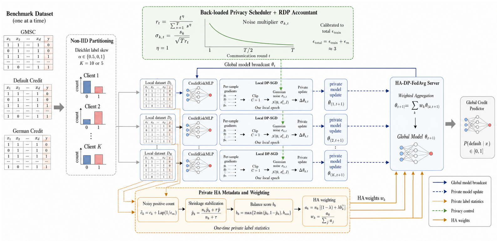

# HA-DP-FedAvg

Official research code for:

> **HA-DP-FedAvg: Privacy Scheduling and Heterogeneity-Aware Aggregation
> for Federated Credit Risk Prediction**

HA-DP-FedAvg combines an RDP-calibrated back-loaded Gaussian-noise schedule
with private label-balance-aware aggregation for record-level differentially
private federated credit risk prediction.



## Scope

The paper evaluates three public binary credit datasets:

| Dataset | Records | Features | Clients |
|---|---:|---:|---:|
| Default of Credit Card Clients | 30,000 | 23 | 10 |
| Give Me Some Credit (GMSC) | 150,000 | 10 | 10 |
| German Credit | 1,000 | 24 | 5 |

Training data are partitioned class-wise with a Dirichlet distribution using
`alpha=0.5` and `alpha=0.1`. The primary private comparison uses 50
communication rounds, full client participation, one local epoch, and a total
privacy budget of approximately `epsilon=3`. The HA variants reserve
`epsilon_m=0.1` for a one-time private release of client label counts.

The final factorial comparison contains:

| Variant | Noise schedule | Aggregation |
|---|---|---|
| `dp_uniform` | uniform | sample-size |
| `scheduler` | back-loaded | sample-size |
| `ha_uniform` | uniform | heterogeneity-aware |
| `full_ha_dp` | back-loaded | heterogeneity-aware |

## Repository layout

```text
src/                 models, preprocessing, privacy accounting, and trainers
tests/               unit, accounting, analysis, and smoke tests
jobs/                portable Slurm jobs used for the paper experiments
data/README.md        dataset sources and expected local paths
results/tables/       paper-facing final CSV and JSON artifacts
results/figures/      generated paper figures
docs/                 method overview and reproducibility notes
RELEASE_NOTES.md      release contents and validation record
main_*.py             single-dataset experiment entry points
run_*.py              tuning, ablation, baseline, and sensitivity suites
analyze_*.py          statistical and calibration analyses
```

Raw datasets, checkpoints, predictions, caches, and HPC logs are intentionally
excluded.

## Environment

The paper experiments used Python 3.10, PyTorch 2.6, and Opacus 1.6.

```bash
python -m venv .venv
source .venv/bin/activate
python -m pip install --upgrade pip
python -m pip install -r requirements.txt
python -m pip install -r requirements-dev.txt
python -m pip install -r requirements-optional.txt
python -m pytest -q
```

Install a CUDA-enabled PyTorch build appropriate for the local NVIDIA driver.
The code also runs on CPU, but the complete experiment matrices are much
slower.

## Data

Download the datasets separately and place them at the paths documented in
[`data/README.md`](data/README.md). No benchmark data are redistributed in this
repository.

## Quick check

The dry run validates the final experiment matrix without training:

```bash
python run_submission_extensions_v5.py \
  --dataset default_credit \
  --variants dp_uniform scheduler ha_uniform full_ha_dp \
  --dry-run
```

A small smoke run can then verify the complete training path:

```bash
python run_submission_extensions_v5.py \
  --dataset german \
  --variants dp_uniform scheduler ha_uniform full_ha_dp \
  --smoke
```

## Paper experiments

The Slurm scripts in `jobs/` encode the paper configurations. Configure the
cluster environment as described in [`jobs/README.md`](jobs/README.md), then
submit the jobs from the repository root. The three final V6 ablation jobs
train all four methods from scratch and do not depend on early experiment
outputs.

```bash
sbatch jobs/default_credit_final_ablation_v6.sbatch
sbatch jobs/german_final_ablation_10seed_v6.sbatch
sbatch jobs/gmsc_final_ablation_10seed_v6.sbatch

sbatch jobs/default_credit_reference_baselines_v6.sbatch
sbatch jobs/german_reference_baselines_v6.sbatch
sbatch jobs/gmsc_reference_baselines_v6.sbatch
```

The 75/100-round sensitivity jobs require the corresponding completed
50-round final-ablation CSV:

```bash
sbatch jobs/default_credit_round_sensitivity_v6.sbatch
sbatch jobs/gmsc_round_sensitivity_v6.sbatch
```

See [`docs/REPRODUCIBILITY.md`](docs/REPRODUCIBILITY.md) for the full dependency
order and analysis commands.

## Included results

`results/tables/final/` contains the final per-seed raw CSV files, mean/std
summaries, paired effects, client-profile summaries, cost summaries, and
integrity report used to prepare the paper. Development-only diagnostics,
including the privacy-utility curve and probability-calibration report, are in
`results/tables/diagnostics/`.

## Privacy scope

The implementation targets fixed-size replace-one **record-level DP within
each client**. It does not provide client-level participation privacy. RDP
accounting composes every local optimizer step across communication rounds.
The reported global privacy loss is the maximum composed client loss because
clients contain disjoint records.

Every result row records its privacy configuration and whether the run met the
implementation's strict privacy-claim checks. Use those fields when filtering
or reporting results.

## Citation

Citation metadata are provided in [`CITATION.cff`](CITATION.cff). Please cite
the paper and this repository if the code is used in published work.

## License

This project is released under the [MIT License](LICENSE).
